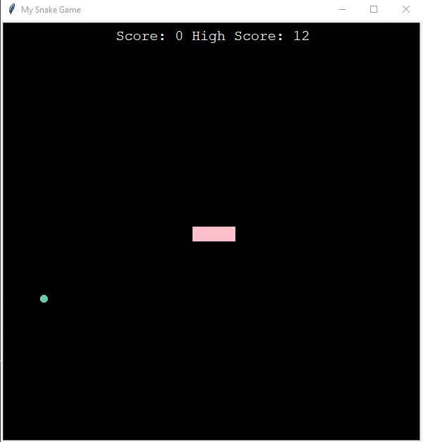

# Snake Game

Desktop version of the famous Snake Game created in Python using the Tkinter library.

by [@ericczop](https://github.com/ericczop)

## Run Locally

Clone the project:

```bash
git clone https://github.com/ericczop/SnakeGame-Python
```

Go to the project directory:

```bash
cd Python-SnakeGame
```

Run script:


```bash
python3 main.py
```

## Screenshots:

